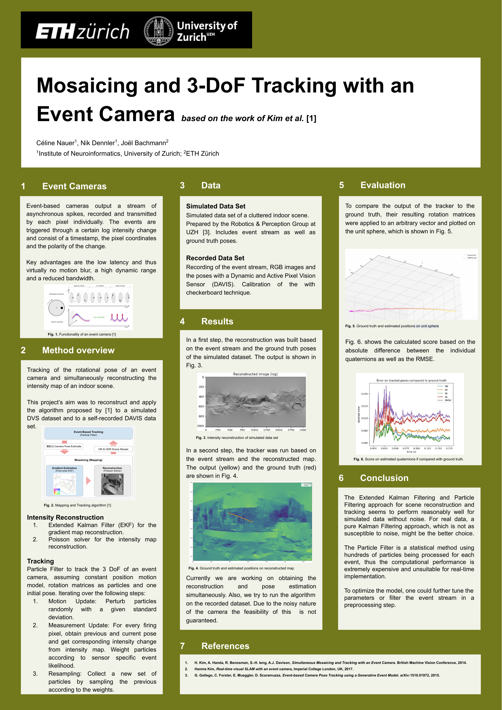

# Event Based Camera Project: Simultaneous Mosaicing and Tracking

Authors: Céline Nauer, Joël Bachmann, Nik Dennler

We attempt to implement the methods proposed by Kim et. al (2014) to simultaneously map the environment and track the camera pose in SO(3). For the mapping part, we are heavily guided by the MATLAB code written by G. Gallego of RPG. For the tracking algorithm, we implemented the theoretical framework of a particle filter for event cameras proposed by Kim et. al (2014). 

This project is a part of the lecture 3D Vision by M. Pollefeys at ETHZ. 

References: 
 1. H. Kim, A. Handa, R. Benosman, S.-H. Ieng, A.J. Davison, 
  [*Simultaneous Mosaicing and Tracking with an Event Camera*](http://www.bmva.org/bmvc/2014/files/paper066.pdf).
  British Machine Vision Conference, 2014.

 2. H. Rebecq, T. Horstschaefer, G. Gallego, D. Scaramuzza, 
  [*EVO: A Geometric Approach to Event-based 6-DOF Parallel Tracking and Mapping in Real-time*](http://rpg.ifi.uzh.ch/docs/RAL16_EVO.pdf). 
  IEEE Robotics and Automation Letters (RA-L), Vol. 2, Issue 2, pp. 593-600, Apr. 2017.

 3. G. Gallego, C. Forster, E. Mueggler, D. Scaramuzza, 
  [*Event-based Camera Pose Tracking using a Generative Event Model*](https://arxiv.org/pdf/1510.01972v1).
  arXiv:1510.01972, 2015.

